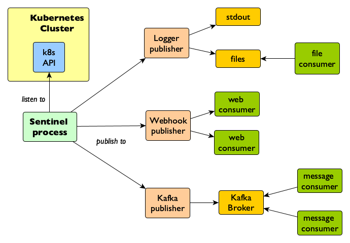

# Sentinel 

Sentinel is a Go application, which looks for state changes of [kubernetes objects](https://kubernetes.io/docs/concepts/overview/working-with-objects/kubernetes-objects/), and publish their associated metadata to specific endpoints for further processing by downstream systems.

The application process can either run inside or outside of a [Kubernetes](https://kubernetes.io/docs/concepts/) cluster and can publish events to either a [webhook](https://en.wikipedia.org/wiki/Webhook) or to an instance of the [Apache Kafka](https://kafka.apache.org/) message broker.

The following image shows how the application works:



## API compatibility

The current version uses the [Kubernetes API 1.11.10](https://github.com/kubernetes/api/releases/tag/kubernetes-1.11.10), compatible with Openshift 3.11.

To build the solution for another api version, the dependencies in the [go module](./go.mod) file has to be updated, for example, using [go get](https://golang.org/cmd/go/#hdr-Module_aware_go_get) as follows:

```bash
# for example, to update to version 1.14.2
$ go get -u k8s.io/api@kubernetes-1.14.2
$ go get -u k8s.io/apimachinery@kubernetes-1.14.2
$ go get -u k8s.io/client-go@kubernetes-1.14.2
```

__NOTE__: the minimal required [go version is 1.12.5](https://golang.org/dl/)

## Multi Cluster publishing with Kafka

The following example shows a configuration where events are published from three Kubernetes clusters into Kafka:


## Configuration

The Sentinel process can be configured by either a [config file](./config.toml) or via environment variables.

Environment variables is set, override the values in the config file.

The available variables are described below.

### General Vars

| Name | Description | Default |
|---|---|---|
| __SL_KUBECONFIG__ | the path to the kubernetes configuration file used by the Sentinel to connect to the kubernetes API. | ~/.kube/config |
| __SL_PUBLISHERS_MODE__ | defines which publisher to use (i.e. webhook, broker, logger) | logger |

### _Webhook Publisher Variables_

| Name | Description | Default |
|---|---|---|
| __SL_PUBLISHERS_WEBHOOK_URI__ | the uri of the webhook | localhost:8080/sentinel |
| __SL_PUBLISHERS_WEBHOOK_AUTHENTICATION__ | authentication mode to use for posting events to the webhook endpoint (i.e. none, basic) | - |
| __SL_PUBLISHERS_WEBHOOK_USERNAME__ | the optional username for basic authentication | sentinel |
| __SL_PUBLISHERS_WEBHOOK_PASSWORD__ | the optional password for basic authentication | s3nt1nel |

### _Broker Publisher Variables_

| Name | Description | Default |
|---|---|---|
| __SL_PUBLISHERS_BROKER_ADDR__ | the address to bind to | ":8080" |
| __SL_PUBLISHERS_BROKER_BROKERS__ | the Kafka brokers to connect to, as a comma separated list | - |
| __SL_PUBLISHERS_BROKER_VERBOSE__ | turn on logging | false |
| __SL_PUBLISHERS_BROKER_CERTIFICATE__ | optional certificate file for client authentication | - |
| __SL_PUBLISHERS_BROKER_KEY__ | optional key file for client authentication | - |
| __SL_PUBLISHERS_BROKER_CA__ | optional certificate authority file for TLS client authentication | - |
| __SL_PUBLISHERS_BROKER_VERIFY__ | optional verify ssl certificates chain | false |

### _Observable Object Variables_

| Name | Description | Default |
|---|---|---|
| __SL_OBSERVE_SERVICE__ | whether to observe create, update and delete service events | true |
| __SL_OBSERVE_POD__ | whether to observe create, update and delete pod events | true |
| __SL_OBSERVE_PERSISTENTVOLUME__ | whether to observe create, update and delete persistent volume events | true |
| __SL_OBSERVE_NAMESPACE__ | whether to observe create, update and delete namespace events | true |
| __SL_OBSERVE_DEPLOYMENT__ | whether to observe create, update and delete deployment events | false |
| __SL_OBSERVE_REPLICATIONCONTROLLER__ | whether to observe create, update and delete replication controller events | false |
| __SL_OBSERVE_REPLICASET__ | whether to observe create, update and delete replica set events | false |
| __SL_OBSERVE_DAEMONSET__ | whether to observe create, update and delete daemon set events | false |
| __SL_OBSERVE_JOB__ | whether to observe create, update and delete job events | false |
| __SL_OBSERVE_SECRET__ | whether to observe create, update and delete secret events | false |
| __SL_OBSERVE_CONFIGMAP__ | whether to observe create, update and delete config map events | false |
| __SL_OBSERVE_INGRESS__ | whether to observe create, update and delete ingress events | false |


[*] _The Sentinel icon was made by [Freepik](https://www.freepik.com) from [Flaticon](https://www.flaticon.com) and is licensed by [Creative Commons BY 3.0](http://creativecommons.org/licenses/by/3.0)_